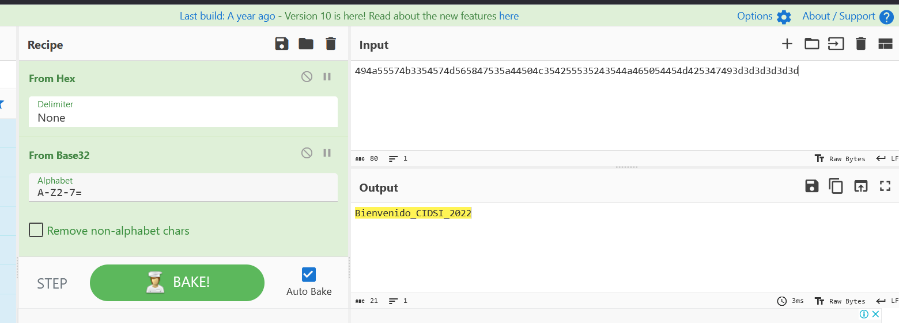

# PASE PERDIDO =’) POR LA TÓXICA XD

## 80 pts

## Enunciado

Pablito faltó a clases y quiere participar en la 4 Competencia de Seguridad Informática CIDSI, uno de sus docentes le dejo una pista, será que Pablito participa de la Competencia???

```bash
494a55574b3354574d565847535a44504c354255535243544a465054454d425347493d3d3d3d3d3d
```

## Resolución cybercheft



[convertirlo a md5](https://www.md5hashgenerator.com/) o ejecutar el comando:

```bash
# -n evita el salto de linea de la cadena de texto
# sed 's/ .*//' para eliminar cualquier texto adicional de la salida
echo -n "Bienvenido_CIDSI_2022" | md5sum | sed 's/ .*//'

```

solucion:

```bash
cidsi{28e043ef6109375dafe8d541f2896bed}
```
