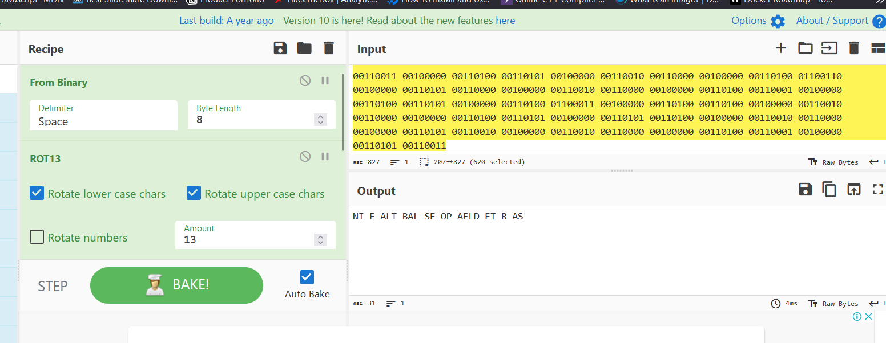
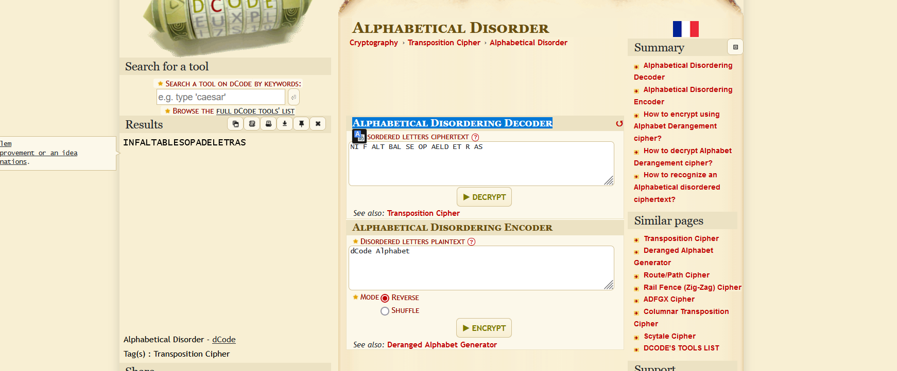

# Sopa de letras para 25 personas

## 300 pts

No hay nada como una sopa muy cargada de vitaminas:

```bash
00110100 01100101 00100000 00110100 00111001 00100000 00110010 00110000 00100000 00110100 00110110 00100000 00110010 00110000 00100000 00110100 00110001 00100000 00110100 01100011 00100000 00110101 00110100 00100000 00110010 00110000 00100000 00110100 00110010 00100000 00110100 00110001 00100000 00110100 01100011 00100000 00110010 00110000 00100000 00110101 00110011 00100000 00110100 00110101 00100000 00110010 00110000 00100000 00110100 01100110 00100000 00110101 00110000 00100000 00110010 00110000 00100000 00110100 00110001 00100000 00110100 00110101 00100000 00110100 01100011 00100000 00110100 00110100 00100000 00110010 00110000 00100000 00110100 00110101 00100000 00110101 00110100 00100000 00110010 00110000 00100000 00110101 00110010 00100000 00110010 00110000 00100000 00110100 00110001 00100000 00110101 00110011
```

## Resolucion en cyberchef



Ejecutar los algoritmos de decodificacion como:

1. From bynary
2. ROT13
3. ROT13
4. From Hex

finalmente con el resultado.

```bash
NI F ALT BAL SE OP AELD ET R AS
```

Colocarlo en dcode con el decodificador "Alphabetical Disordering Decoder".



## Resultado

```bash
$ echo -n "INFALTABLESOPADELETRAS" | md5sum | sed 's/ .*//'
a3d8adec318b119db66397de13005f8b
cidsi{a3d8adec318b119db66397de13005f8b}
```
