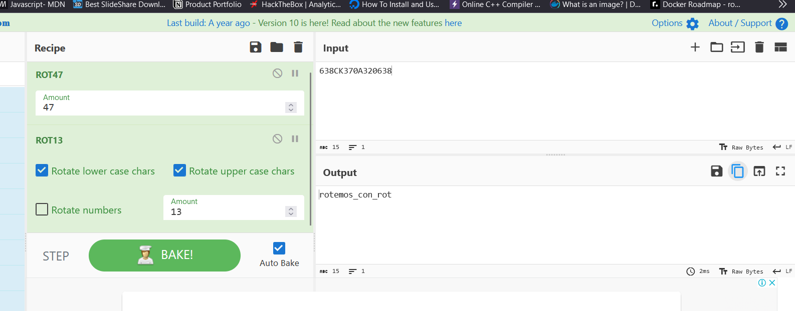

# rotamos_si_rotamos_no

## 100 pts

Esto es otro de los cifrados de cajon espero lo resuelvas rapido.

```bash
638CK370A320638
```

## Resolucion con cyberchef



```bash
$ echo -n "rotemos_con_rot" | md5sum | sed 's/ .*//'
fb297129c28923015076ff9bf921f244
```
