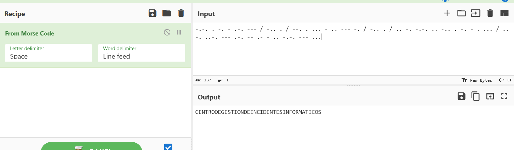

# samuel

## 50 pts

Nuestro amigo nos dejo este mensaje al parecer trabaja ahí.

```bash
-.-. . -. - .-. --- / -.. . / --. . ... - .. --- -. / -.. . / .. -. -.-. .. -.. . -. - . ... / .. -. ..-. --- .-. -- .- - .. -.-. --- ...
```

## Resolucion en cybercheft



Se usa una variante de la palabra probando con varias de ellas hasta llegar a este resultado.

```bash
$ echo -n "Centro de Gestion de Incidentes Informaticos" | md5sum | sed 's/ .*//'
a3c286bbdd83377855c59a84fdb98772
```

solucion:

```bash
cidsi{a3c286bbdd83377855c59a84fdb98772}
```
