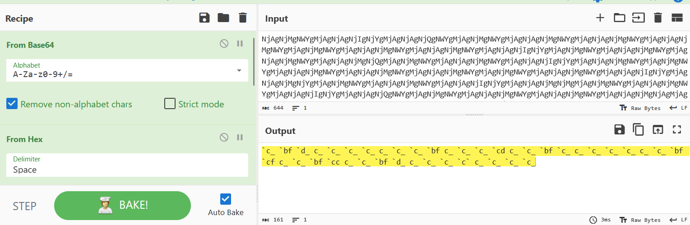
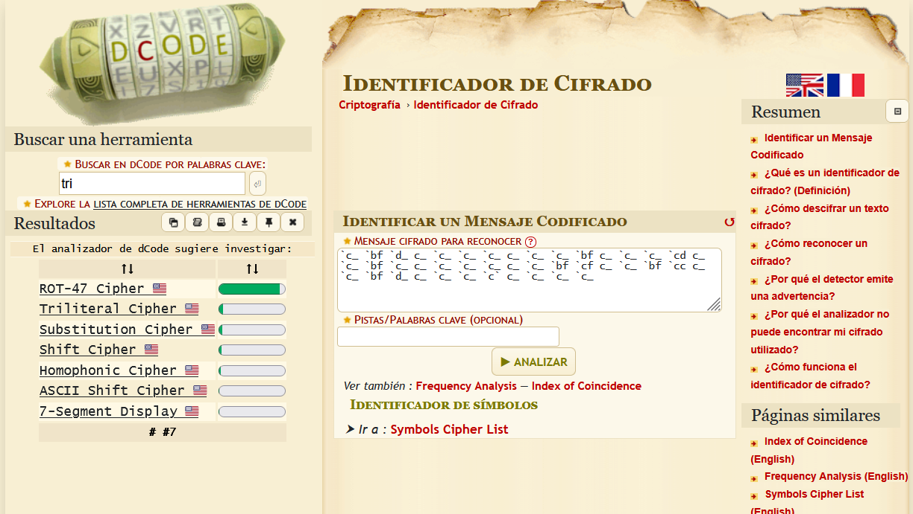
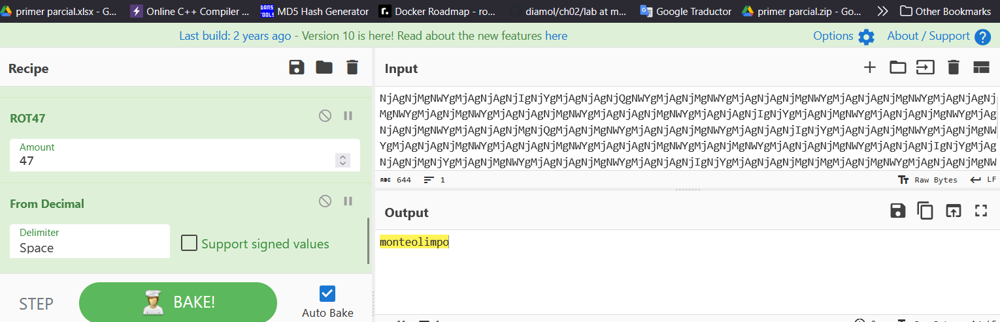

# una vuelta mas

## 500 pts

A Zeus se le antojó un helado con pasas al ron, pero el mensajero no llegaba, después de horas llego Hermes, pero estaba agotado de llevar tantos mensajes, entonces Zeus le dijo que se vaya a dar una vuelta más y que él también se compre otro helado del sabor que quiera.

```bash
NjAgNjMgNWYgMjAgNjAgNjIgNjYgMjAgNjAgNjQgNWYgMjAgNjMgNWYgMjAgNjAgNjMgNWYgMjAgNjAgNjMgNWYgMjAgNjAgNjMgNWYgMjAgNjMgNWYgMjAgNjAgNjMgNWYgMjAgNjAgNjMgNWYgMjAgNjAgNjIgNjYgMjAgNjMgNWYgMjAgNjAgNjMgNWYgMjAgNjAgNjMgNWYgMjAgNjAgNjMgNjQgMjAgNjMgNWYgMjAgNjAgNjMgNWYgMjAgNjAgNjIgNjYgMjAgNjAgNjMgNWYgMjAgNjMgNWYgMjAgNjAgNjMgNWYgMjAgNjAgNjMgNWYgMjAgNjAgNjMgNWYgMjAgNjMgNWYgMjAgNjAgNjMgNWYgMjAgNjAgNjIgNjYgMjAgNjAgNjMgNjYgMjAgNjMgNWYgMjAgNjAgNjMgNWYgMjAgNjAgNjIgNjYgMjAgNjAgNjMgNjMgMjAgNjMgNWYgMjAgNjAgNjMgNWYgMjAgNjAgNjIgNjYgMjAgNjAgNjQgNWYgMjAgNjMgNWYgMjAgNjAgNjMgNWYgMjAgNjAgNjMgNWYgMjAgNjAgNjMgNjAgMjAgNjMgNWYgMjAgNjAgNjMgNWYgMjAgNjAgNjMgNWYgMjAgNjAgNjMgNWY=
```

## Resolucion

primero se lo coloco en cyberchef y en el automaticamente identifico que era encriptacion de base 64 y posteriormente un hexaecimal.



Ya es este punto se uso dcode para analizar el resultado y muestra lo siguiente:



Entonces aplicamos esa capa extra a la descencriptacion, inmediatamente cyberchef detecta que es un octal y como el titulo dice "una vuelta mas" eso hacemos aplicando otro rot 47 y con la deteccion automatica de que la ultima capa de encriptado esta en decimal. resultado de todas las capas:

1. From base64
2. From hex
3. Rot 47
4. From octal
5. Rot 47
6. From decimal



resultado:

```bash
$ echo -n "monteolimpo" | md5sum | sed 's/ .*//'
11eb1ea1f85c164406d97ca5701f8d53
```
